<head>
    
    
</head>

# 常用信号分析方法

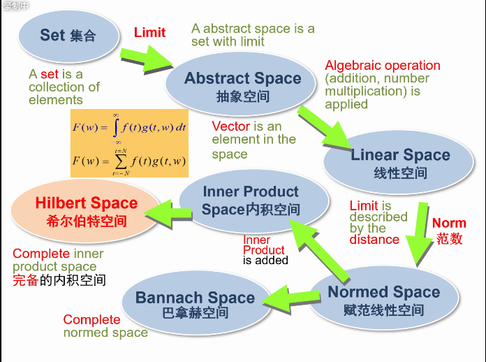

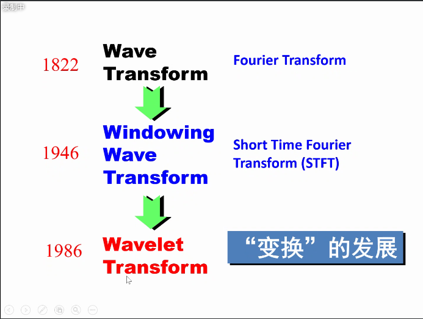

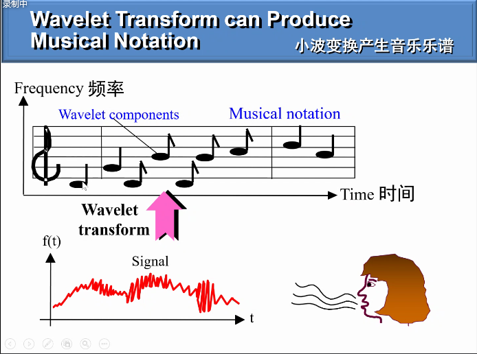

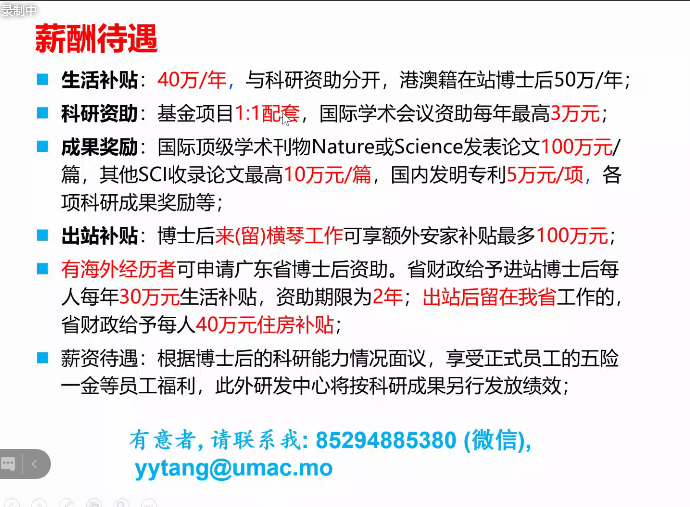

## 1、奇异谱分析-SSA（Singular Spectrum Analysis）

[奇异谱分析](https://wiki.mbalib.com/wiki/奇异谱分析)

[SSA tutorial with Matlab](https://ww2.mathworks.cn/matlabcentral/fileexchange/58967-singular-spectrum-analysis-beginners-guide/?s_tid=ILM2FXsub)

## 2、常用公式

欧拉公式：

$e^{ix}$=cosx+i*sinx

$e^{jwx}=coswx+j*sinwx$

傅里叶变换公式：

$s(w)=\frac{1}{2\pi}\int_{-\infty}^{+\infty}x(t)e^{-jwt}dt$

傅里叶逆变换公式：

$x(t)=\frac{1}{2\pi}\int_{-\infty}^{+\infty}s(w)e^{jwt}dt$

## 3、信号双谱特征

## 4、基本的实验做法

* 信号来源 

  * 仿真
    * 不同信噪比
  * 真实

* 传统特征

  * 高阶(双谱)
  * 希尔伯特谱
  * 时域信号(图像)

  

## 5、论文初筛列表

* EI

  基于堆栈式 ＬＳＴＭ 网络的通信辐射源个体识别;

  基于变分自编码器的雷达辐射源个体识别

  基于机器学习的辐射源识别_苟嫣

  基于机器学习的雷达辐射源识别方法综述_孟磊

  基于局部双谱和深度卷积神经网络的通信电台识别研究_曹阳

  基于人工智能的辐射源识别技术研究_袁博

  基于深度残差网络的ADS_B信号辐射源个体识别_翁琳天然

  基于时频分析和CNN的雷达辐射源识别算法_黄智

  基于栈式稀疏降噪自编码网络的辐射源调制识别_李东瑾

  深度学习方法在雷达信号识别若干问题上的研究与应用_陈俊达

  

  
  
  
  
  
  
  
  
* 小样本

  * 数据扩充

  * 分类方法 

* 信号仿真参考图书

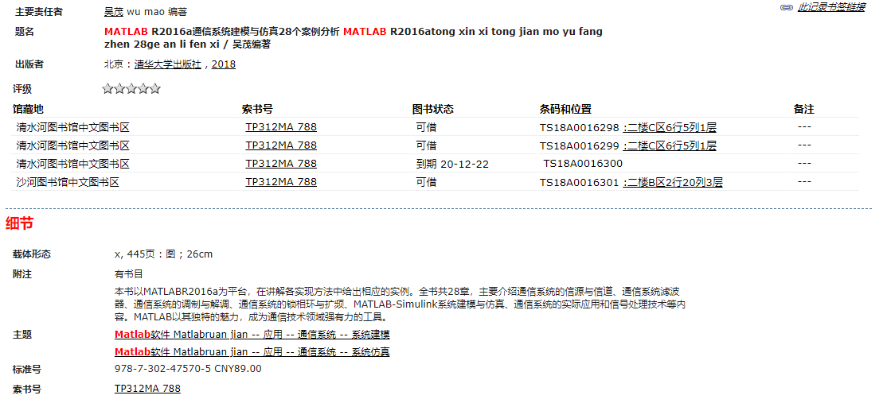

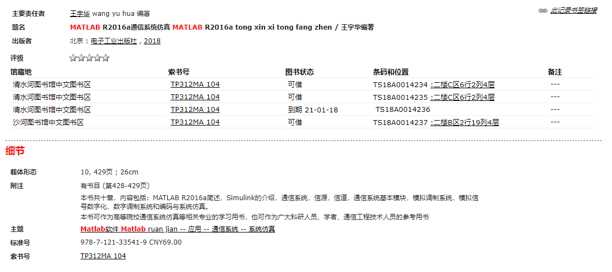

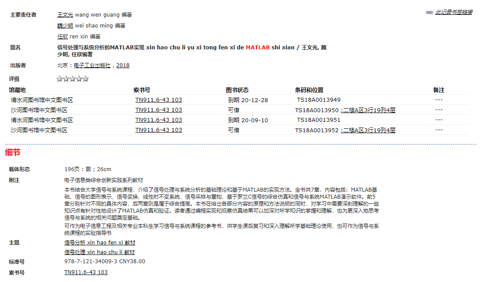

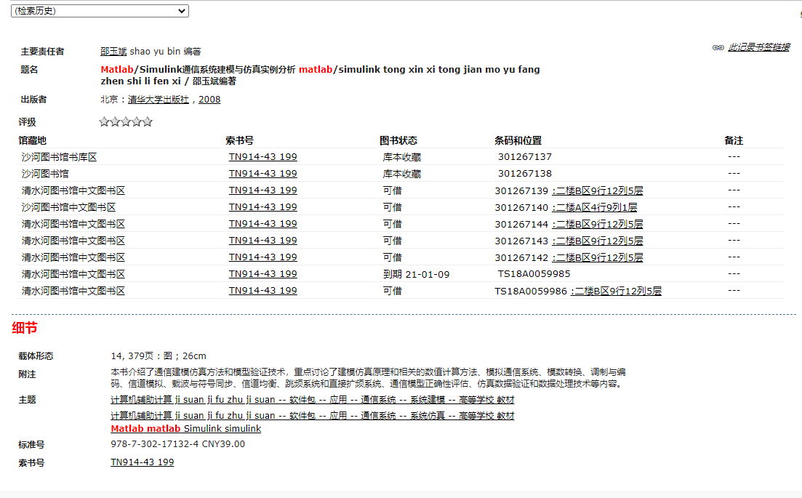

## 6、实验设置

* 查找公开数据集

* 产生仿真信号  

  * HFSS仿真软件
  * 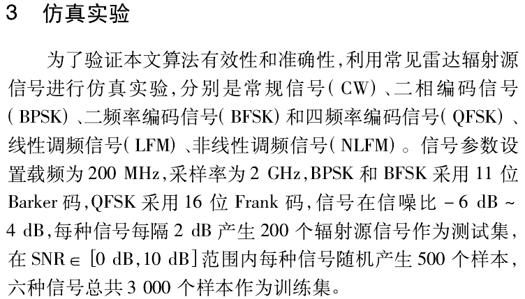
  * 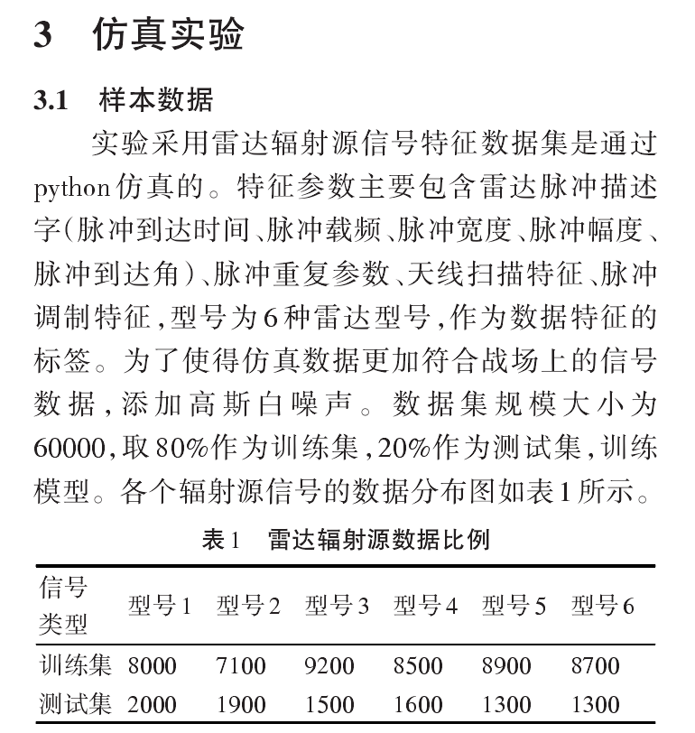
  * 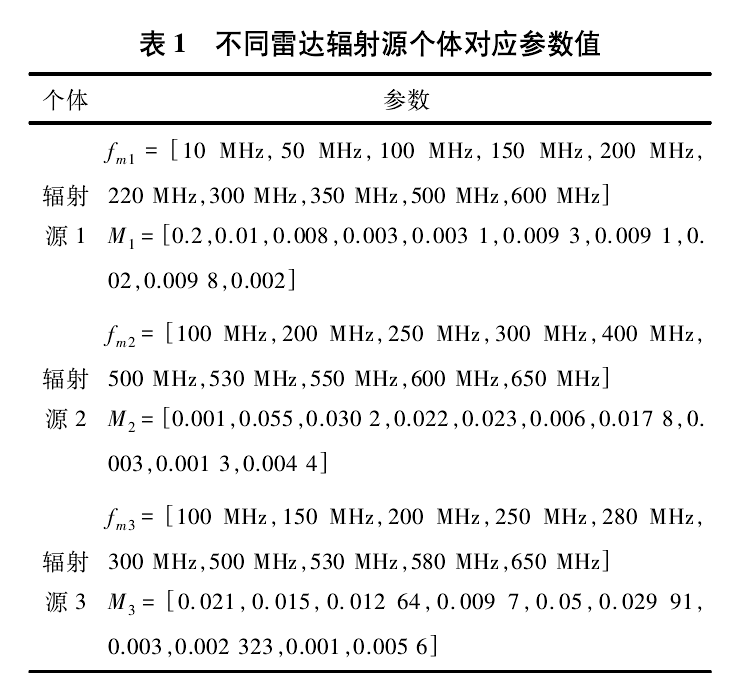
  * 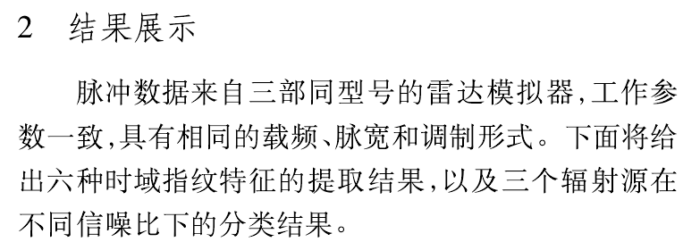
  * 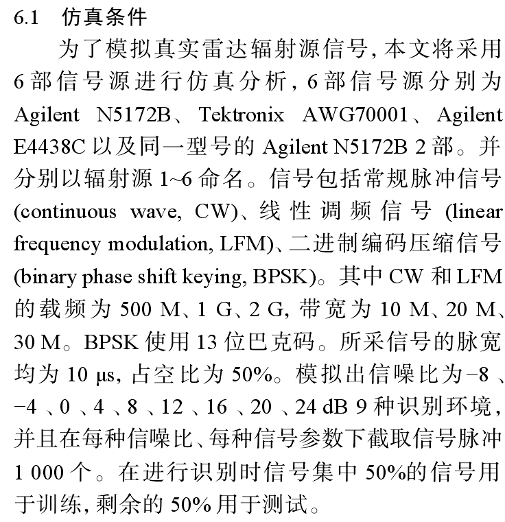
  * 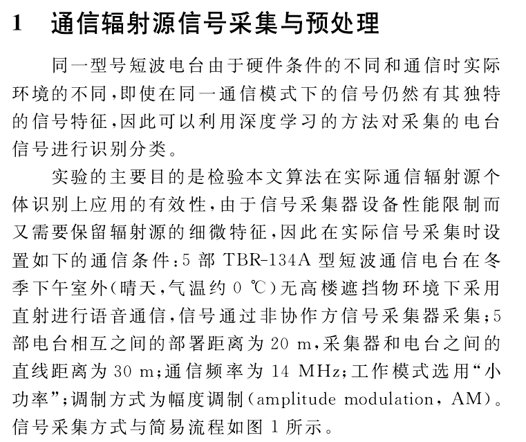
  * 
  * 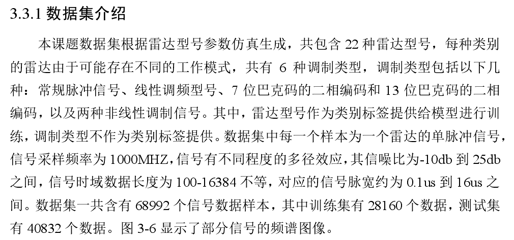
  * 

* 产生仿真假信号

* 信号处理——提取传统特征

* 信号识别

  * 小样本方法
    * 匹配
    * GAN无监督 

  

## 雷达数据搜索关键词

* radar pluse data
* radar waveform data
* radio signal 
* ADS-B pulse data

## 借阅信息

